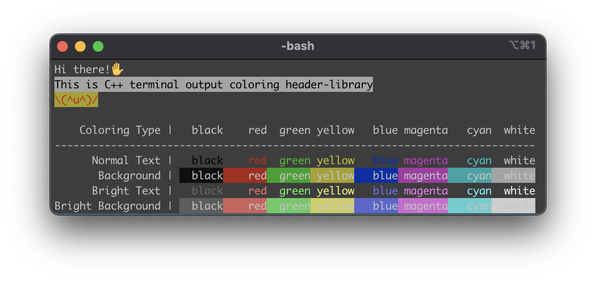

# iro
C++ terminal output coloring header-library.

`iro` (色; いろ) is Japanese word which mean "color".

# run sample

```bash
$ git clone https://github.com/ysuzuki19/iro
$ cd iro
$ make
$ make run
```

# how to use

```cpp
// include iro/include/iro.hpp
std::cout << Iro::yellow("Hello ")
          << Iro::cyan("World")
          << Iro::green("!")
          << std::endl;
```

# demos
## Ubuntu


## MacOS

